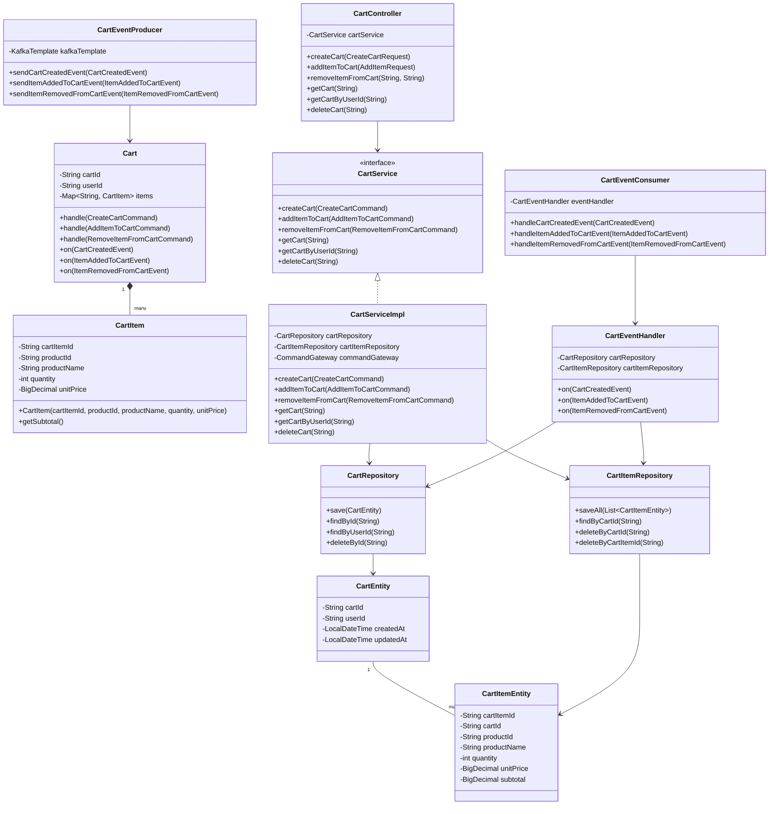

# Amazon Platform Project Documentation

### Project Overview

The Amazon Platform is a microservices-based e-commerce application that implements the SAGA and CQRS (Command Query Responsibility Segregation) patterns. It's built using Spring Boot and Axon Framework, with reactive programming support through Spring WebFlux and R2DBC. The platform simulates a shopping experience similar to Amazon, with services for cart management, order processing, payment handling, dispatch, and delivery.

### Architecture

The project follows a microservices architecture with the following components:

1. **Cart Service**: Manages shopping carts and cart items
2. **Order Service**: Handles order creation and management
3. **Payment Service**: Processes payments for orders
4. **Dispatch Service**: Manages order dispatching
5. **Delivery Service**: Handles order delivery
6. **Common Module**: Contains shared domain models, commands, and events
7. **Kafka Config Module**: Provides Kafka configuration for event-driven communication

#### High-Level Architecture Diagram

The following diagram illustrates the complete architecture of the Amazon Platform:


This diagram illustrates:

1. **CQRS Pattern**: Each service has separate Command and Query APIs
2. **Event-Driven Architecture**: Services communicate through the Kafka Event Bus
3. **Database per Service**: Each microservice has its own database
4. **API Gateway**: Entry point for client applications
5. **Microservices**: Cart, Order, Payment, Dispatch, and Delivery services

Each service has its own database and communicates with other services through events published to Kafka topics. The Order Service implements the SAGA pattern to coordinate the entire order processing workflow across multiple services.

### Technology Stack

- **Java 17**: Core programming language
- **Spring Boot 3.5.4**: Application framework
- **Spring WebFlux**: Reactive web framework
- **Axon Framework 4.9.3**: CQRS and Event Sourcing framework
- **R2DBC**: Reactive database connectivity
- **PostgreSQL**: Primary database
- **Kafka**: Event streaming platform
- **Project Lombok**: Reduces boilerplate code
- **Maven**: Build and dependency management

### Design Patterns

#### CQRS (Command Query Responsibility Segregation)
The application separates command operations (write) from query operations (read):
- Commands: Used to modify state (e.g., CreateCartCommand, AddItemToCartCommand)
- Queries: Used to retrieve data
- Events: Represent state changes (e.g., CartCreatedEvent, ItemAddedToCartEvent)

##### CQRS Pattern Sequence Diagram

The following diagram illustrates how the system implements the CQRS pattern across multiple services:


##### CQRS Pattern Implementation Details

This diagram illustrates how the Cart Service implements the CQRS pattern:

1. **Command-Query Separation**:
   - **Command Side**: Handles commands that modify state (CreateCartCommand, AddItemToCartCommand)
   - **Query Side**: Handles queries that read state but don't modify it

2. **Event Sourcing**:
   - Commands result in events (CartCreatedEvent, ItemAddedToCartEvent)
   - Events represent state changes and are the source of truth
   - Events are published to Kafka Event Bus

3. **Materialized Views**:
   - Query side maintains optimized read models (views)
   - Views are updated based on events
   - Provides efficient querying capabilities

4. **Eventual Consistency**:
   - Other services consume events to maintain their own view of cart data
   - System becomes eventually consistent as events propagate

#### SAGA Pattern
The OrderSaga class orchestrates the order processing workflow across multiple services:
1. Order creation
2. Payment processing
3. Order dispatching
4. Order delivery

The saga includes compensating transactions to handle failures at any step, ensuring data consistency across services.

##### Order Processing Sequence Diagram (SAGA Pattern)

The following diagram illustrates the complete end-to-end flow from cart creation to order delivery using the SAGA pattern:


##### Error Handling and Compensation Transactions

The following diagram illustrates how the system handles failures and implements compensating transactions:


##### Dispatch Failure Handling

The following diagram illustrates how the system handles dispatch failures:


##### System Error Handling

The following diagram illustrates how the system handles system exceptions during saga execution:


The SAGA pattern implementation includes:

1. **Orchestration**: The OrderSaga class orchestrates the entire workflow
2. **Sequential Steps**: Order creation → Payment → Dispatch → Delivery
3. **Event-Driven Communication**: Services communicate through events
4. **Compensation Transactions**: In case of failures, compensating actions maintain data consistency:
   - If payment fails: Order status is updated to PAYMENT_FAILED
   - If dispatch fails: Order status is updated to DISPATCH_FAILED
   - If delivery fails: Order status is updated to DELIVERY_FAILED
5. **Saga State Management**: The saga maintains state throughout the transaction

#### Complete End-to-End Flow Diagram

The following diagram illustrates the complete end-to-end flow from cart creation to order delivery, showing the interaction between all services:


This end-to-end flow diagram illustrates:

1. **Cart Management**: The client creates a cart and adds items through the Cart Service
2. **Order Creation**: The client creates an order using the items in the cart
3. **SAGA Orchestration**: The OrderSaga orchestrates the entire order processing workflow
4. **Payment Processing**: The Payment Service processes the payment for the order
5. **Order Dispatching**: The Dispatch Service handles the order dispatch
6. **Order Delivery**: The Delivery Service manages the order delivery
7. **Status Updates**: The Order Service updates the order status at each step
8. **Query Operations**: The client can query the cart and order status at any point

The diagram shows how the CQRS and SAGA patterns work together to provide a complete e-commerce solution with clear separation of concerns and reliable transaction management across multiple services.

### Database Configuration

The project uses PostgreSQL with reactive support through R2DBC:

- Each microservice has its own database:
  - cart_db
  - payment_db
  - order_db
  - dispatch_db
  - delivery_db

A setup script (`setup-postgres.sh`) is provided to create these databases.

### Kafka Implementation

Kafka is used for event-driven communication between microservices:

#### Kafka Topics
- **cart-events**: Events related to shopping carts
- **order-events**: Events related to orders
- **payment-events**: Events related to payments
- **dispatch-events**: Events related to dispatches
- **delivery-events**: Events related to deliveries

#### Kafka Event Flow Diagram

The following diagram illustrates the event flow between services through Kafka:


#### Event Flow
1. An order is created, and an OrderCreatedEvent is sent to the order-events topic
2. The payment service processes the payment and sends a PaymentProcessedEvent to the payment-events topic
3. The dispatch service processes the dispatch and sends an OrderDispatchedEvent to the dispatch-events topic
4. The delivery service processes the delivery and sends an OrderDeliveredEvent to the delivery-events topic
5. The order service updates the order status based on these events

### Service Details

#### Cart Service
- Manages shopping carts and cart items
- Handles commands: CreateCartCommand, AddItemToCartCommand, RemoveItemFromCartCommand
- Publishes events: CartCreatedEvent, ItemAddedToCartEvent, ItemRemovedFromCartEvent

#### Order Service
- Manages orders and order items
- Implements the OrderSaga to coordinate the order process
- Handles commands: CreateOrderCommand, UpdateOrderStatusCommand
- Publishes events: OrderCreatedEvent, OrderStatusUpdatedEvent

#### Payment Service
- Processes payments for orders
- Handles commands: ProcessPaymentCommand
- Publishes events: PaymentProcessedEvent

#### Dispatch Service
- Manages order dispatching
- Handles commands: DispatchOrderCommand
- Publishes events: OrderDispatchedEvent

#### Delivery Service
- Manages order delivery
- Handles commands: DeliverOrderCommand
- Publishes events: OrderDeliveredEvent

### Setup and Running the Application

#### Prerequisites
- Java 17
- Maven
- PostgreSQL
- Kafka

#### Setup Steps
1. Clone the repository
2. Run the PostgreSQL setup script:
   ```bash
   ./setup-postgres.sh
   ```
3. Start Kafka:
   ```bash
   docker run -d --name kafka -p 9092:9092 -e KAFKA_ADVERTISED_LISTENERS=PLAINTEXT://localhost:9092 -e KAFKA_LISTENERS=PLAINTEXT://0.0.0.0:9092 -e KAFKA_ZOOKEEPER_CONNECT=zookeeper:2181 wurstmeister/kafka
   ```
4. Build the project:
   ```bash
   ./mvnw clean install
   ```
5. Start each service:
   ```bash
   ./mvnw spring-boot:run -pl cart-service
   ./mvnw spring-boot:run -pl order-service
   ./mvnw spring-boot:run -pl payment-service
   ./mvnw spring-boot:run -pl dispatch-service
   ./mvnw spring-boot:run -pl delivery-service
   ```

#### Testing
A test script (`test-amazon-platform.sh`) is provided to simulate the entire order flow:
```bash
./test-amazon-platform.sh
```

### Future Enhancements

1. **Kafka Streams**: Implement for complex event processing
2. **Dead Letter Queues**: Add for handling failed messages
3. **Retry Mechanisms**: Implement for failed message processing
4. **Monitoring and Alerting**: Add for Kafka topics and consumers
5. **Axon with Kafka**: Configure Axon Framework to use Kafka as the event store

### Low-Level Implementation Diagrams

This section provides detailed low-level diagrams showing the internal implementation of each service.

#### Cart Service Class Diagram

The following diagram illustrates the class structure and relationships within the Cart Service:



This class diagram shows:

1. **Domain Model**: The `Cart` aggregate and `CartItem` value object
2. **Repository Layer**: `CartRepository` and `CartItemRepository` interfaces with their entity classes
3. **Service Layer**: `CartService` interface and `CartServiceImpl` implementation
4. **Controller Layer**: `CartController` for handling HTTP requests
5. **Event Handling**: `CartEventHandler` for processing events
6. **Kafka Integration**: `CartEventProducer` and `CartEventConsumer` for event-driven communication

#### Order Service Class Diagram

The following diagram illustrates the class structure and relationships within the Order Service, including the SAGA implementation:


This class diagram shows:

1. **Domain Model**: The `Order` aggregate, `OrderItem` value object, and `OrderStatus` enumeration
2. **SAGA Orchestration**: The `OrderSaga` class that coordinates the order processing workflow
3. **Repository Layer**: `OrderRepository` and `OrderItemRepository` interfaces with their entity classes
4. **Service Layer**: `OrderService` interface and `OrderServiceImpl` implementation
5. **Controller Layer**: `OrderController` for handling HTTP requests
6. **Event Handling**: `OrderEventHandler` for processing events
7. **Kafka Integration**: `OrderEventProducer` and `OrderEventConsumer` for event-driven communication

#### Database Schema Diagrams

The following diagrams illustrate the database schemas for each service:

##### Cart Service Database Schema


##### Order Service Database Schema


##### Payment Service Database Schema


##### Dispatch Service Database Schema


##### Delivery Service Database Schema


#### CQRS Implementation Details Diagram

The following diagram illustrates the detailed implementation of the CQRS pattern in the services:


This diagram shows:

1. **Command Side**: Handles commands that modify state
   - Command API receives commands from the controller
   - Command Handler processes commands
   - Aggregate Root applies business rules and generates events
   - Event Sourcing stores events in the Event Store
   - Event Publisher sends events to the Kafka Event Bus

2. **Query Side**: Handles queries that read state
   - Query API receives queries from the controller
   - Query Handler processes queries
   - Read Model provides optimized data for queries
   - Database stores the read model
   - Event Handler updates the read model based on events from Kafka

#### SAGA Implementation Details Diagram

The following diagram illustrates the detailed implementation of the SAGA pattern in the Order Service:


This diagram shows:

1. **SAGA Orchestration**: The Order Saga coordinates the entire workflow
2. **Sequential Steps**: Order creation → Payment → Dispatch → Delivery
3. **Command-Event Flow**: Commands trigger service operations, which produce events
4. **Compensation Transactions**: Handling failures at each step
   - Payment failure: Update order status to PAYMENT_FAILED
   - Dispatch failure: Update order status to DISPATCH_FAILED
   - Delivery failure: Update order status to DELIVERY_FAILED
5. **System Error Handling**: Handling exceptions during saga execution

### Conclusion

The Amazon Platform project demonstrates a modern microservices architecture using SAGA and CQRS patterns with event-driven communication through Kafka. The reactive programming model with R2DBC provides scalability and performance benefits. The project serves as a reference implementation for building complex e-commerce systems with distributed transaction management.

The low-level diagrams provide detailed insights into the implementation of each service, showing the class structures, relationships, database schemas, and pattern implementations. These diagrams complement the high-level architecture diagrams and sequence diagrams to provide a comprehensive understanding of the system.