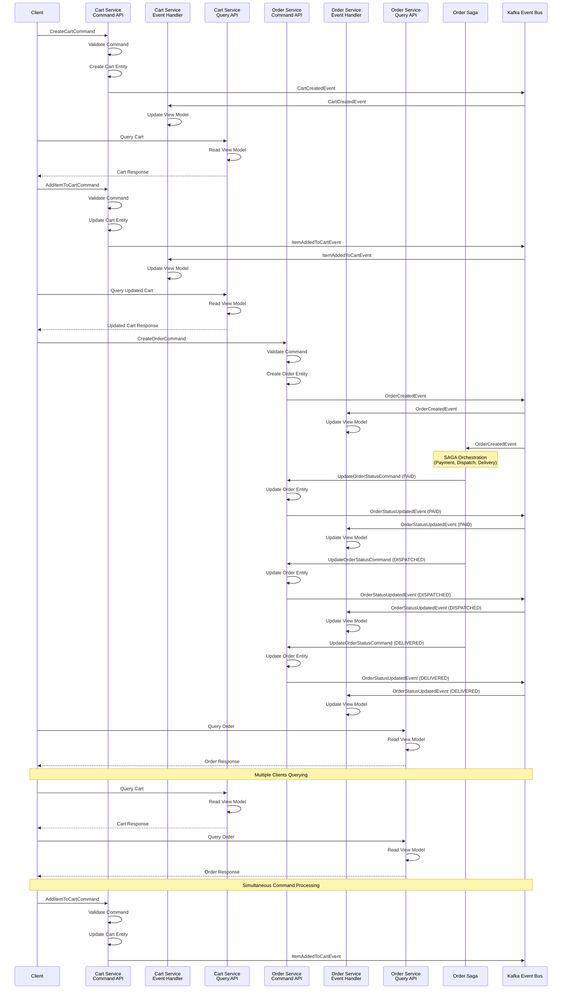

```mermaid
sequenceDiagram
    participant Client
    participant CartCommandAPI as Cart Service<br/>Command API
    participant CartEventHandler as Cart Service<br/>Event Handler
    participant CartQueryAPI as Cart Service<br/>Query API
    participant OrderCommandAPI as Order Service<br/>Command API
    participant OrderEventHandler as Order Service<br/>Event Handler
    participant OrderQueryAPI as Order Service<br/>Query API
    participant OrderSaga as Order Saga
    participant Kafka as Kafka Event Bus
    
    %% Cart Creation - Command Side
    Client->>CartCommandAPI: CreateCartCommand
    CartCommandAPI->>CartCommandAPI: Validate Command
    CartCommandAPI->>CartCommandAPI: Create Cart Entity
    CartCommandAPI->>Kafka: CartCreatedEvent
    
    %% Cart Creation - Event Handling
    Kafka->>CartEventHandler: CartCreatedEvent
    CartEventHandler->>CartEventHandler: Update View Model
    
    %% Cart Query - Query Side
    Client->>CartQueryAPI: Query Cart
    CartQueryAPI->>CartQueryAPI: Read View Model
    CartQueryAPI-->>Client: Cart Response
    
    %% Add Item to Cart - Command Side
    Client->>CartCommandAPI: AddItemToCartCommand
    CartCommandAPI->>CartCommandAPI: Validate Command
    CartCommandAPI->>CartCommandAPI: Update Cart Entity
    CartCommandAPI->>Kafka: ItemAddedToCartEvent
    
    %% Add Item to Cart - Event Handling
    Kafka->>CartEventHandler: ItemAddedToCartEvent
    CartEventHandler->>CartEventHandler: Update View Model
    
    %% Cart Query - Query Side
    Client->>CartQueryAPI: Query Updated Cart
    CartQueryAPI->>CartQueryAPI: Read View Model
    CartQueryAPI-->>Client: Updated Cart Response
    
    %% Create Order - Command Side
    Client->>OrderCommandAPI: CreateOrderCommand
    OrderCommandAPI->>OrderCommandAPI: Validate Command
    OrderCommandAPI->>OrderCommandAPI: Create Order Entity
    OrderCommandAPI->>Kafka: OrderCreatedEvent
    
    %% Create Order - Event Handling
    Kafka->>OrderEventHandler: OrderCreatedEvent
    OrderEventHandler->>OrderEventHandler: Update View Model
    Kafka->>OrderSaga: OrderCreatedEvent
    
    %% SAGA Orchestration (simplified)
    Note over OrderSaga: SAGA Orchestration<br/>(Payment, Dispatch, Delivery)
    
    %% Order Status Updates - Event Handling
    OrderSaga->>OrderCommandAPI: UpdateOrderStatusCommand (PAID)
    OrderCommandAPI->>OrderCommandAPI: Update Order Entity
    OrderCommandAPI->>Kafka: OrderStatusUpdatedEvent (PAID)
    Kafka->>OrderEventHandler: OrderStatusUpdatedEvent (PAID)
    OrderEventHandler->>OrderEventHandler: Update View Model
    
    OrderSaga->>OrderCommandAPI: UpdateOrderStatusCommand (DISPATCHED)
    OrderCommandAPI->>OrderCommandAPI: Update Order Entity
    OrderCommandAPI->>Kafka: OrderStatusUpdatedEvent (DISPATCHED)
    Kafka->>OrderEventHandler: OrderStatusUpdatedEvent (DISPATCHED)
    OrderEventHandler->>OrderEventHandler: Update View Model
    
    OrderSaga->>OrderCommandAPI: UpdateOrderStatusCommand (DELIVERED)
    OrderCommandAPI->>OrderCommandAPI: Update Order Entity
    OrderCommandAPI->>Kafka: OrderStatusUpdatedEvent (DELIVERED)
    Kafka->>OrderEventHandler: OrderStatusUpdatedEvent (DELIVERED)
    OrderEventHandler->>OrderEventHandler: Update View Model
    
    %% Order Query - Query Side
    Client->>OrderQueryAPI: Query Order
    OrderQueryAPI->>OrderQueryAPI: Read View Model
    OrderQueryAPI-->>Client: Order Response
    
    %% Multiple Clients Querying - Demonstrating CQRS Benefits
    Note over Client,Kafka: Multiple Clients Querying
    
    Client->>CartQueryAPI: Query Cart
    CartQueryAPI->>CartQueryAPI: Read View Model
    CartQueryAPI-->>Client: Cart Response
    
    Client->>OrderQueryAPI: Query Order
    OrderQueryAPI->>OrderQueryAPI: Read View Model
    OrderQueryAPI-->>Client: Order Response
    
    Note over Client,Kafka: Simultaneous Command Processing
    
    Client->>CartCommandAPI: AddItemToCartCommand
    CartCommandAPI->>CartCommandAPI: Validate Command
    CartCommandAPI->>CartCommandAPI: Update Cart Entity
    CartCommandAPI->>Kafka: ItemAddedToCartEvent
```