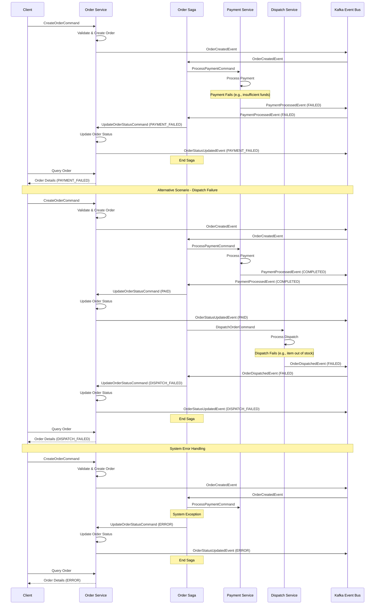

```mermaid
sequenceDiagram
    participant Client
    participant OrderService as Order Service
    participant OrderSaga as Order Saga
    participant PaymentService as Payment Service
    participant DispatchService as Dispatch Service
    participant Kafka as Kafka Event Bus

    %% Order Creation
    Client->>OrderService: CreateOrderCommand
    OrderService->>OrderService: Validate & Create Order
    OrderService->>Kafka: OrderCreatedEvent
    Kafka->>OrderSaga: OrderCreatedEvent
    
    %% Payment Processing - Failure Scenario
    OrderSaga->>PaymentService: ProcessPaymentCommand
    PaymentService->>PaymentService: Process Payment
    Note over PaymentService: Payment Fails (e.g., insufficient funds)
    PaymentService->>Kafka: PaymentProcessedEvent (FAILED)
    Kafka->>OrderSaga: PaymentProcessedEvent (FAILED)
    
    %% Compensation Transaction - Payment Failure
    OrderSaga->>OrderService: UpdateOrderStatusCommand (PAYMENT_FAILED)
    OrderService->>OrderService: Update Order Status
    OrderService->>Kafka: OrderStatusUpdatedEvent (PAYMENT_FAILED)
    Note over OrderSaga: End Saga
    
    %% Client Queries Failed Order
    Client->>OrderService: Query Order
    OrderService-->>Client: Order Details (PAYMENT_FAILED)
    
    %% Alternative Scenario - Dispatch Failure
    Note over Client,Kafka: Alternative Scenario - Dispatch Failure
    
    %% Order Creation and Payment Success
    Client->>OrderService: CreateOrderCommand
    OrderService->>OrderService: Validate & Create Order
    OrderService->>Kafka: OrderCreatedEvent
    Kafka->>OrderSaga: OrderCreatedEvent
    
    OrderSaga->>PaymentService: ProcessPaymentCommand
    PaymentService->>PaymentService: Process Payment
    PaymentService->>Kafka: PaymentProcessedEvent (COMPLETED)
    Kafka->>OrderSaga: PaymentProcessedEvent (COMPLETED)
    
    %% Update Order Status - PAID
    OrderSaga->>OrderService: UpdateOrderStatusCommand (PAID)
    OrderService->>OrderService: Update Order Status
    OrderService->>Kafka: OrderStatusUpdatedEvent (PAID)
    
    %% Dispatch Failure
    OrderSaga->>DispatchService: DispatchOrderCommand
    DispatchService->>DispatchService: Process Dispatch
    Note over DispatchService: Dispatch Fails (e.g., item out of stock)
    DispatchService->>Kafka: OrderDispatchedEvent (FAILED)
    Kafka->>OrderSaga: OrderDispatchedEvent (FAILED)
    
    %% Compensation Transaction - Dispatch Failure
    OrderSaga->>OrderService: UpdateOrderStatusCommand (DISPATCH_FAILED)
    OrderService->>OrderService: Update Order Status
    OrderService->>Kafka: OrderStatusUpdatedEvent (DISPATCH_FAILED)
    Note over OrderSaga: End Saga
    
    %% Client Queries Failed Order
    Client->>OrderService: Query Order
    OrderService-->>Client: Order Details (DISPATCH_FAILED)
    
    %% System Error Handling
    Note over Client,Kafka: System Error Handling
    
    %% Exception during Saga Execution
    Client->>OrderService: CreateOrderCommand
    OrderService->>OrderService: Validate & Create Order
    OrderService->>Kafka: OrderCreatedEvent
    Kafka->>OrderSaga: OrderCreatedEvent
    
    OrderSaga->>PaymentService: ProcessPaymentCommand
    Note over OrderSaga: System Exception
    
    %% Error Handling
    OrderSaga->>OrderService: UpdateOrderStatusCommand (ERROR)
    OrderService->>OrderService: Update Order Status
    OrderService->>Kafka: OrderStatusUpdatedEvent (ERROR)
    Note over OrderSaga: End Saga
    
    %% Client Queries Failed Order
    Client->>OrderService: Query Order
    OrderService-->>Client: Order Details (ERROR)
```