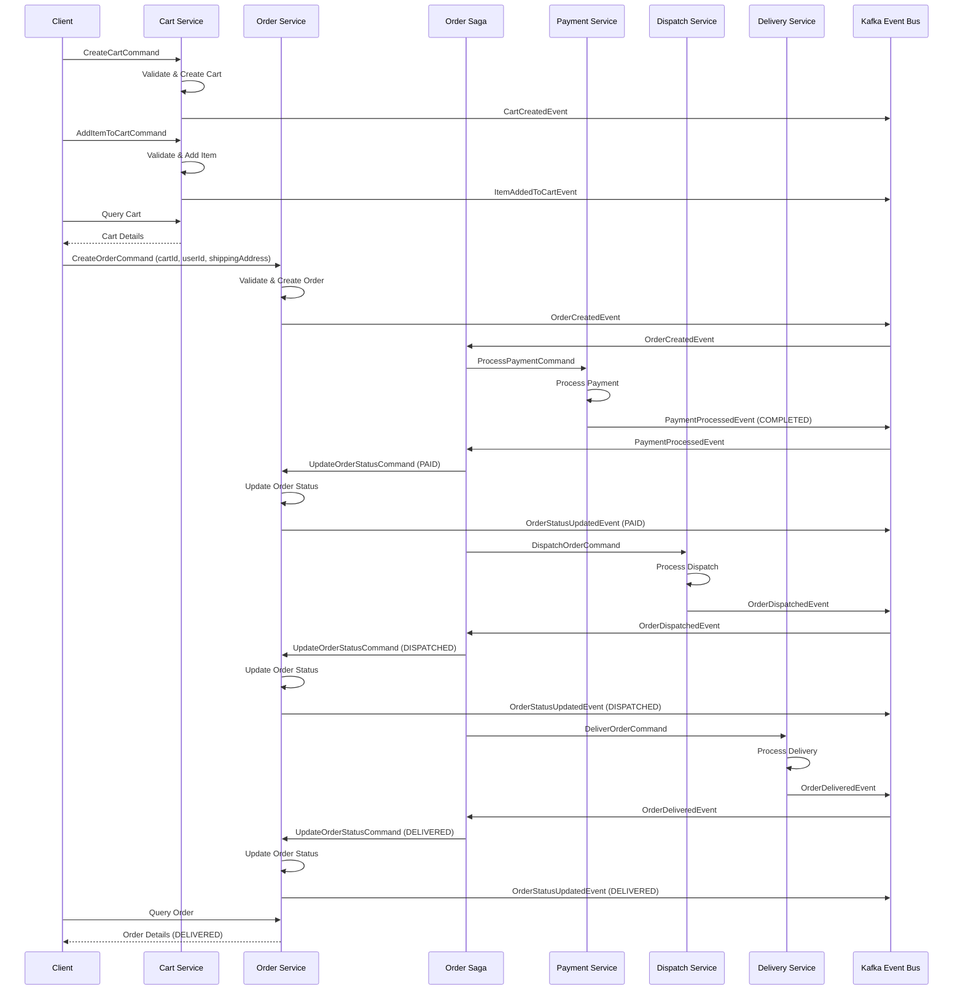

```mermaid
sequenceDiagram
    participant Client
    participant CartService as Cart Service
    participant OrderService as Order Service
    participant OrderSaga as Order Saga
    participant PaymentService as Payment Service
    participant DispatchService as Dispatch Service
    participant DeliveryService as Delivery Service
    participant Kafka as Kafka Event Bus

    %% Cart Creation and Management
    Client->>CartService: CreateCartCommand
    CartService->>CartService: Validate & Create Cart
    CartService->>Kafka: CartCreatedEvent
    
    Client->>CartService: AddItemToCartCommand
    CartService->>CartService: Validate & Add Item
    CartService->>Kafka: ItemAddedToCartEvent
    
    Client->>CartService: Query Cart
    CartService-->>Client: Cart Details
    
    %% Order Creation
    Client->>OrderService: CreateOrderCommand (cartId, userId, shippingAddress)
    OrderService->>OrderService: Validate & Create Order
    OrderService->>Kafka: OrderCreatedEvent
    Kafka->>OrderSaga: OrderCreatedEvent
    
    %% Payment Processing
    OrderSaga->>PaymentService: ProcessPaymentCommand
    PaymentService->>PaymentService: Process Payment
    PaymentService->>Kafka: PaymentProcessedEvent (COMPLETED)
    Kafka->>OrderSaga: PaymentProcessedEvent
    
    %% Update Order Status - PAID
    OrderSaga->>OrderService: UpdateOrderStatusCommand (PAID)
    OrderService->>OrderService: Update Order Status
    OrderService->>Kafka: OrderStatusUpdatedEvent (PAID)
    
    %% Order Dispatch
    OrderSaga->>DispatchService: DispatchOrderCommand
    DispatchService->>DispatchService: Process Dispatch
    DispatchService->>Kafka: OrderDispatchedEvent
    Kafka->>OrderSaga: OrderDispatchedEvent
    
    %% Update Order Status - DISPATCHED
    OrderSaga->>OrderService: UpdateOrderStatusCommand (DISPATCHED)
    OrderService->>OrderService: Update Order Status
    OrderService->>Kafka: OrderStatusUpdatedEvent (DISPATCHED)
    
    %% Order Delivery
    OrderSaga->>DeliveryService: DeliverOrderCommand
    DeliveryService->>DeliveryService: Process Delivery
    DeliveryService->>Kafka: OrderDeliveredEvent
    Kafka->>OrderSaga: OrderDeliveredEvent
    
    %% Update Order Status - DELIVERED
    OrderSaga->>OrderService: UpdateOrderStatusCommand (DELIVERED)
    OrderService->>OrderService: Update Order Status
    OrderService->>Kafka: OrderStatusUpdatedEvent (DELIVERED)
    
    %% Query Order Status
    Client->>OrderService: Query Order
    OrderService-->>Client: Order Details (DELIVERED)
```